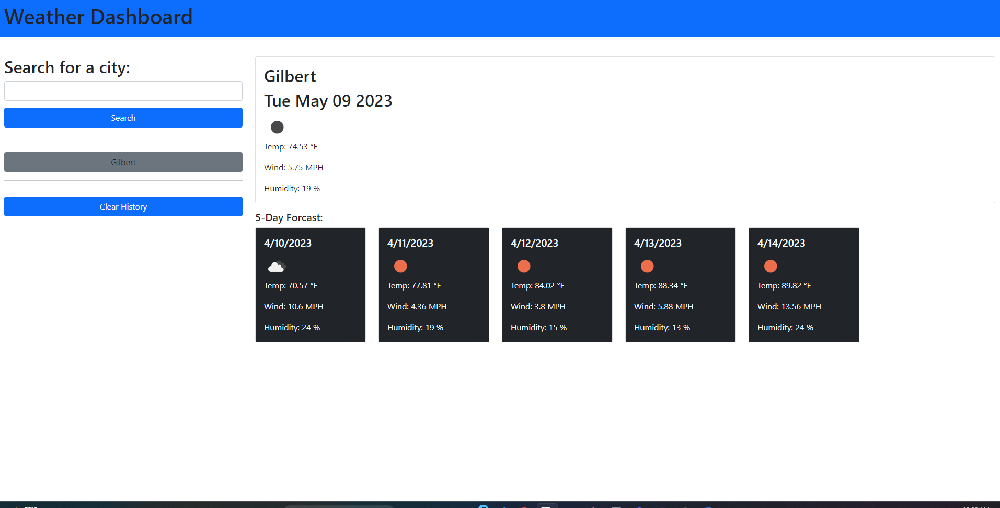

# Weather-Dashboard

## Description
Buono’s Pizza is a family owned and operated pizza shop in Gilbert Arizona. As they are in the process of expanding by opening new pizza shops in the valley, they were in need of a modern website to manage the stores. Our task is to create a new design that will include some fun features and a way for a customer to check the weather forcast for a specific city that they may want to have an event catered by Buono's Pizza.

## Table of Contents
- [Installation](#installation)
- [Usage](#usage)
- [Credits](#credits)
- [License](#license)
- [Badges](#badges)
- [Features](#features)
- [How To Contribute](#howtocontribute)

## Installation
Clone here at: https://github.com/jeremiahmiranda79/Weather-Dashboard

Test here at: https://jeremiahmiranda79.github.io/Weather-Dashboard/

## Usage
- As a customer I want to see the Buono’s pizza shop weather app so i can check weather ofrcast for my location and plan my event.
- As a customer I want to see the Buono’s pizza shop weather app so i can save locations while i plan my event.

## Credits
 - N/A

## License
GNU General Public License v3.0

https://github.com/jeremiahmiranda79/Weather-Dashboard/blob/main/LICENSE

## Badges 🏆

## Features

- Displays the current weather staticly for San Tan Valley, AZ.

- Displays a five day weather forecast staticly for San Tan Valley, AZ.

- Allows a user to search for a city and save it to local storage and display as a button in history.

- A user can select a history button and display its current weather and five day weather forcast.

## How to Contribute
Find us in our Discord group!

https://discord.gg/KU7BNXZJ